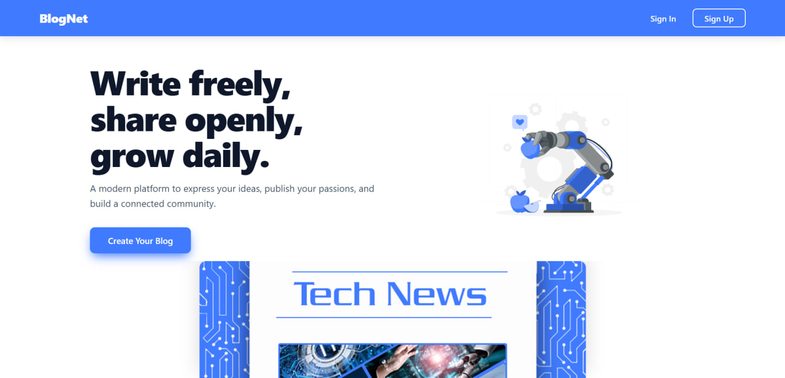
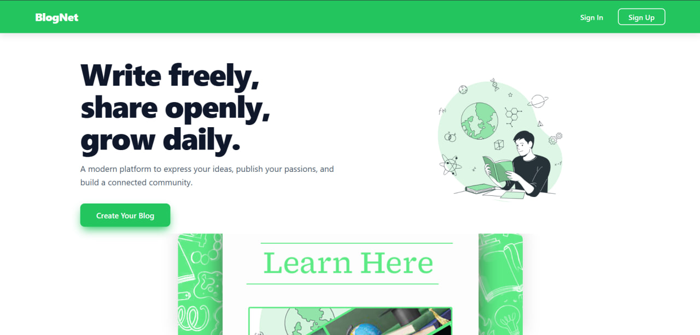
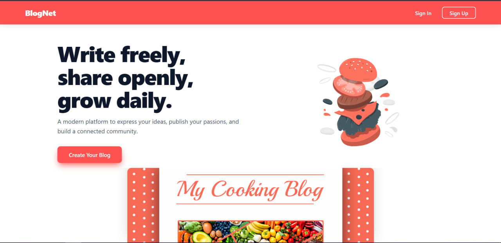
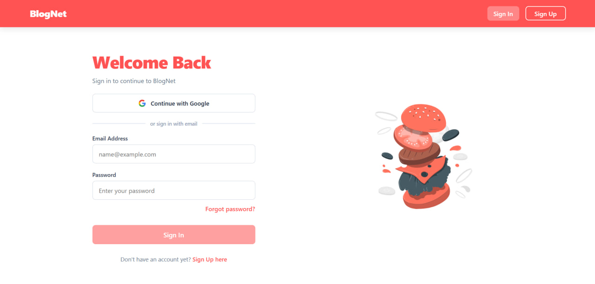

# BlogNet — Enterprise-Grade Full-Stack Blogging Platform

**BlogNet** is a modern, enterprise-ready full-stack blogging web application built with a **Django** REST API backend and a sleek, fast **React (Vite)** SPA frontend. Designed with production standards in mind, it provides custom visual theme variants, OAuth social authentication, and modular Django app architecture.

## Enterprise Styling & Visual Design

BlogNet features an enterprise-class UI/UX architecture designed to offer seamless customization across diverse publication niches. The frontend is engineered with dynamic theme palettes, high-contrast typography, and intuitive layouts that adapt instantly to different content ecosystems.

### UI Preview & Custom Color Palettes

| Tech / Modern (Blue Accent) | Learning / Education (Green Accent) | 
| ----- | ----- | 
|  |  | 

| Lifestyle & Cooking (Red Accent) | Seamless Authentication | 
| ----- | ----- | 
|  |  | 

### Key Design Highlights:

* **Dynamic Theme Engines**: Tailored color systems (`Blue`, `Green`, `Red`) engineered for distinct content verticals (Tech, Education, Food & Lifestyle).
* **Polished Authentication UI**: Modern sign-in page with single-click **Google OAuth** integration, micro-interactions, and accessible form styling.
* **Responsive Layouts**: Designed mobile-first with high pixel density support and smooth layout transitions across screen sizes.

## Repository Structure

The project maintains a clean separation of concerns between backend services, frontend presentation, deployment reverse proxies, and documentation resources.

```
blognet/
├── backend/              # Django backend service & REST API
│   ├── api/              # Core API endpoints & serialization
│   ├── blog/             # Blog management domain & models
│   ├── core/             # Base settings, WSGI/ASGI, config
│   ├── static/           # Source static assets
│   ├── staticfiles/      # Processed production static assets
│   ├── user/             # Authentication & user profile domain
│   ├── utils/            # Helper modules & custom utilities
│   ├── venv/             # Python virtual environment
│   ├── .env              # Backend environment secrets
│   ├── db.sqlite3        # Local development database
│   ├── manage.py         # Django CLI utility
│   ├── requirements.txt  # Python dependencies
│   └── run.py            # Custom application launcher
├── frontend/             # React (Vite) single-page application
│   ├── public/           # Static public assets
│   ├── src/              # React components, routes & state
│   ├── .env              # Frontend environment configuration
│   ├── Caddyfile         # Production reverse-proxy & server config
│   ├── eslint.config.js  # Code quality & linting setup
│   ├── package.json      # Node.js dependencies & scripts
│   └── vite.config.js    # Vite bundler configuration
├── certs/                # SSL/TLS certificates for local HTTPS
├── screenshots/          # High-resolution application screenshots
└── README.md             # Project documentation
```

## Key Technical Features

* **Full-Stack Separation**: Decoupled React frontend communicating asynchronously with Django endpoints.
* **Authentication**: Email/password workflow alongside OAuth 2.0 (Google Login).
* **Production Ready**: Included `Caddyfile` for reverse proxying, auto-HTTPS, and static file serving.
* **Environment Configuration**: Configured with explicit `.env` management across both stack tiers.
* **Scalable Backend**: Django modular app structure (`blog`, `user`, `api`, `core`) for clean codebase maintenance.

## Quick Start Guide

### Prerequisites

Ensure you have the following installed on your local setup:

* **Python**: `3.10+`
* **Node.js**: `18.0+` & `npm`

### 1. Backend Setup (Django)

1. Navigate to the backend directory:
   ```bash
   cd backend
   ```

2. Activate the virtual environment:
   * **Windows**:
     ```cmd
     .\venv\Scripts\activate
     ```
   * **macOS/Linux**:
     ```bash
     source venv/bin/activate
     ```

3. Install required dependencies:
   ```bash
   pip install -r requirements.txt
   ```

4. Run migrations and start the backend development server:
   ```bash
   python manage.py migrate
   python manage.py runserver
   # Alternatively, execute: python run.py
   ```

   *Backend will run on:* `http://127.0.0.1:8000`

### 2. Frontend Setup (React + Vite)

1. Open a new terminal and navigate to the frontend directory:
   ```bash
   cd frontend
   ```

2. Install dependencies:
   ```bash
   npm install
   ```

3. Start the Vite development server:
   ```bash
   npm run dev
   ```

   *Frontend will run on:* `http://localhost:5173`

## Production Deployment

For production deployments, the frontend contains a pre-configured **Caddyfile** for serving built static files with automatic SSL/TLS termination using the certificates stored in `/certs`.

1. **Build Frontend**:
   ```bash
   cd frontend
   npm run build
   ```

2. **Collect Django Static Assets**:
   ```bash
   cd backend
   python manage.py collectstatic --noinput
   ```

3. **Serve with Caddy**:
   ```bash
   caddy run --config frontend/Caddyfile
   ```

## License

Distributed under the MIT License. See `LICENSE` for more information.